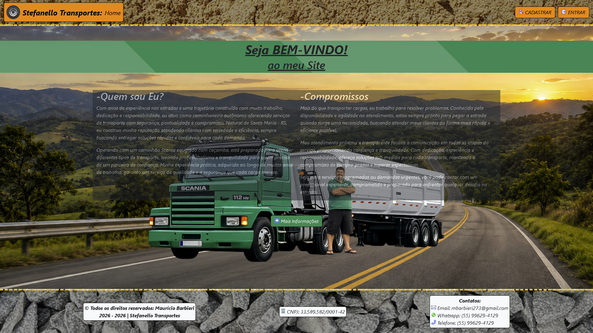
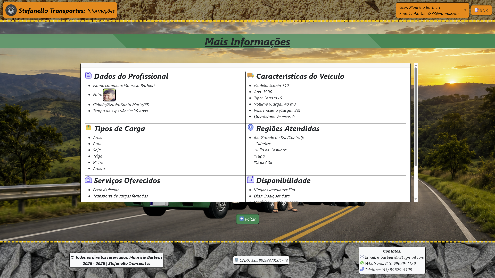

# 🚛 Stefanello Transportes
- Status: 🟢 Concluído

---

## 📑 Índice

- Sobre
- Funcionalidades
- Stack
- Estrutura
- Demonstração
- Pré-Requisitos
- Instalação
- Variáveis
- Docker
- Deploy
- Roadmap
- Licença
- Autor

---

## 📜 Sobre

Aplicação web informativa com **Laravel**, com foco em:

- Vizualização de dados.
- Armazenamento de arquivos.

---

## ✨ Funcionalidades

- Página Home
- Cadastro, Login, Verificação
- Página Mais Informações
- Envio de arquivos
- Atualização de dados, deleção de conta

---

## 🧱 Stack

- **Backend:** PHP 8.5.3 + Laravel 13
- **Frontend build:** Vite + Livewire/CSS
- **Banco de dados:** MySQL 8
- **Testes:** PestPHP (Feature tests)
- **Containerização:** Docker

---

## 📁 Estrutura Principal

```text
app/
├── Http/    
    ├── Controllers/      # Controladores da aplicação. (MainController, Archives, etc.)
    └── Middleware/       # Regras de acesso
├── Models/               # Modelos Eloquent. (User, Data)
database/
├── factories/            # Geração de dados fictícios para testes e seeders. (UserFactory, DataFactory, etc.)
├── migrations/           # Estrutura do banco
└── seeders/              # População inicial do banco de dados. (DatabaseSeeder)
docs/                     # Imagens usadas pelo site. (Documentação do projeto)
public/
├── assets/
    ├── images/           # Imagens usadas pelo site. (Fundos, Ícones, etc.)
    └── documents/        # Arquivos enviados.
resources/
└── views/                # Telas Blade.
routes/
└── web.php               # Rotas da aplicação.
tests/                    # Testes automatizados.
```

## 📸 Demonstração
| Tela Home | Tela Informações |
|-------------|-----------|
|  |  |

---

## ✅ Pré-Requisitos

- PHP 8.5+
- Composer 2+
- Node.js 20+
- MySQL 8+

---

## 🚀 Como Rodar Localmente

1. Clone o projeto:

```bash
git clone <url-do-repositorio>
cd projeto-partida-laravel
```

2. Instale dependências PHP:

```bash
composer install
```

3. Instale dependências front-end:

```bash
npm install
```

4. Crie o arquivo de ambiente:

```bash
cp .env.example .env
```

5. Gere a chave da aplicação:

```bash
php artisan key:generate
```

6. Configure as variáveis de banco no `.env`.

7. Rode as migrations:

```bash
php artisan migrate
```

8. Rode as seeds:

```bash
php artisan db:seed
```

9. Suba o ambiente de desenvolvimento (server + queue + vite):
 
```bash
composer run dev
```

> O comando acima executa `php artisan serve`, `queue:listen` e `npm run dev` em paralelo.

---
 
## 🧪 Testes

Rodar suíte de testes:
 
```bash
php artisan test
```

Ou via Composer:
 
```bash
composer test
```
 
---

## ⚙️ Variáveis de Ambiente Importantes

Ajuste pelo menos:

- `APP_NAME`, `APP_ENV`, `APP_KEY`, `APP_DEBUG`, `APP_URL`
- `CACHE_STORE`
- `DB_CONNECTION`, `DB_HOST`, `DB_PORT`, `DB_DATABASE`, `DB_USERNAME`, `DB_PASSWORD`
- `LOG_CHANNEL`, `LOG_LEVEL`
- `MAIL_FROM_ADDRESS`, `MAIL_FROM_NAME`, `MAIL_HOST`, `MAIL_MAILER`, `MAIL_PASSWORD`, `MAIL_PORT`, `MAIL_SCHEME`, (Opcional)`MAIL_TIMEOUT`, `MAIL_USERNAME`
- `QUEUE_CONNECTION`
- `SESSION_DRIVER`, `SESSION_HTTP_ONLY`, `SESSION_SECURE_COOKIE`

---

## 🐳 Docker

Este projeto possui `Dockerfile` para facilitar execução/deploy.

Exemplo de build e run:

```bash
docker build -t projeto-partida-laravel .
docker run -p 8080:8080 --env-file .env projeto-partida-laravel
```

Comando de start definido no container:

```bash
php artisan migrate --force && php artisan optimize && php artisan config:cache && php artisan route:cache && php artisan view:cache && php artisan serve --host=0.0.0.0 --port=${PORT:-8080}
```

---

## ☁️ Deploy (Ex.: Railway)

Checklist recomendado:

1. Criar projeto usando o repositório do GitHub.
2. Criar e garantir que o banco MySQL esteja provisionado e acessível.
3. Configurar variáveis de ambiente de produção.
4. Rodar migrations e seeders no deploy (`php artisan migrate --force`, `php artisan db:seed --force`).
 
---

## 🗺️ Roadmap Técnico Sugerido (Melhorias)

- [ ] Galeria

---

## 📄 Licença

Este projeto está licenciado sob a licença MIT.

---

## 👨‍💻 Autor

Projeto desenvolvido por: **Luciano Eduardo Stefanello da Silva**.
